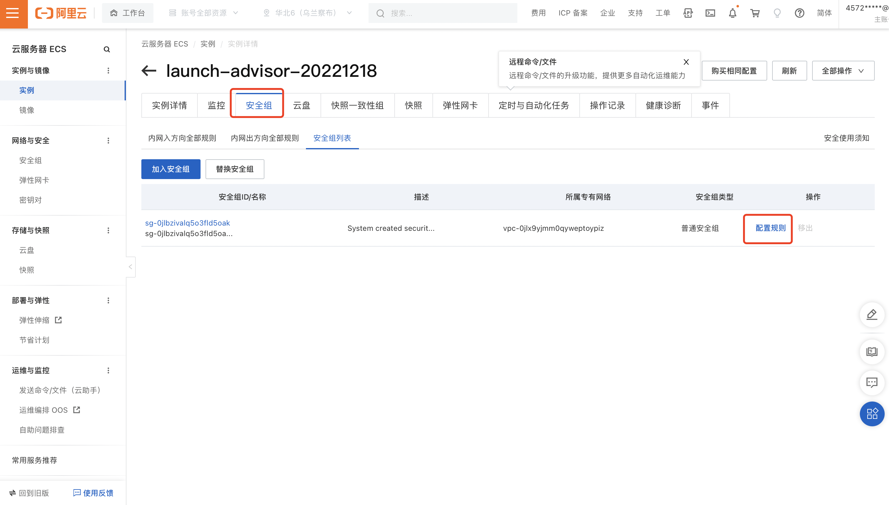
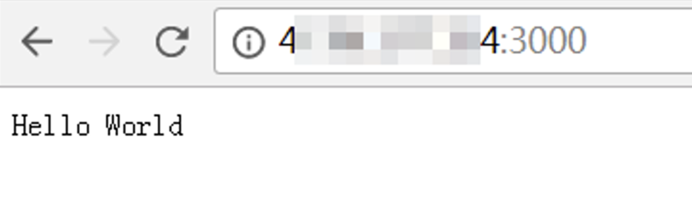

## 前言

本篇文章的前提是拥有一台服务器，并能通过命令行远程连接，如果没有服务器的话，参考下面这篇文章：

- [搭建个人网址(1)——连接服务器](/28862)

---

本篇主要讲解如何搭建个人博客，个人博客可以用来发布自己写的文章等。 


## 一、搭建Node环境
命令如下

1. 下载Node.js安装包。（会下载文件到当前文件夹，默认`/root`）

    ```
    wget https://nodejs.org/dist/v14.17.0/node-v14.17.0-linux-x64.tar.xz
    ```

2. 解压文件。

    ```
    tar xvf node-v14.17.0-linux-x64.tar.xz
    ```

3. 创建软链接，这样就可以在任意目录下直接使用node和npm命令。

    ```
    ln -s /root/node-v14.17.0-linux-x64/bin/node /usr/local/bin/node
    ln -s /root/node-v14.17.0-linux-x64/bin/npm /usr/local/bin/npm
    ```

4. 查看node、npm版本。

    ```
    node -v
    npm -v
    ```

如果能成功查看到版本，则说明Node环境已经安装完毕。


## 二、安装git

```
yum install git
```

## 三、安装hexo

```
 npm install hexo-cli -g
 ln -s /root/node-v14.17.0-linux-x64/bin/hexo /usr/local/bin/hexo
```

## 四、部署博客

1. 拉取代码

```
git clone https://gitee.com/songlj233/hexo-blog.git
cd hexo-blog
```
2. 安装node模块
```
npm install 
```

3. 本地一键运行
```
hexo clean && hexo g && hexo s
```

没报错的话，基本说明项目已经正常运行了。

## 五、添加安全组规则

解释

   `我们访问服务器的端口需要服务器配置，默认是只有80、443等常用端口，像4000端口是没有配置过的，所以需要我们自己手动添加配置。`

具体步骤：

1. 网页登录阿里云的[ECS管理控制台]界面，找到安全组的配置入口。



2. 在入方向中新增4000端口的入网规则即可（也可配置连续的端口，如3000/3010表示3000-3010之间的端口）。


## 五、访问项目

在本地机器的浏览器中输入**`http://IP:4000`**访问项目。（这里的IP就是服务器的IP）



至此，node搭建的已经可以正常访问了。

---

## 小结

至此，个人博客已经搭建，并支持公网访问了。后续介绍下如何增加文章，以及如何更新。

