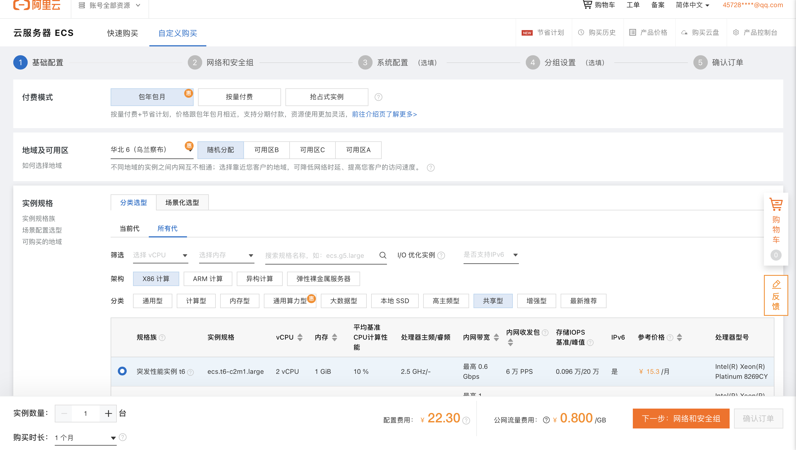
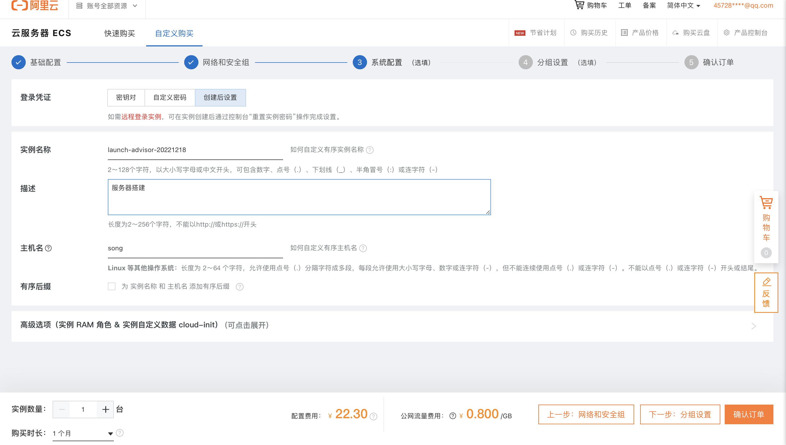
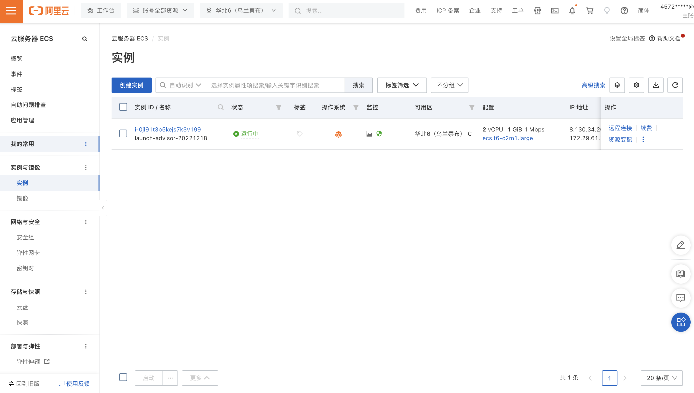
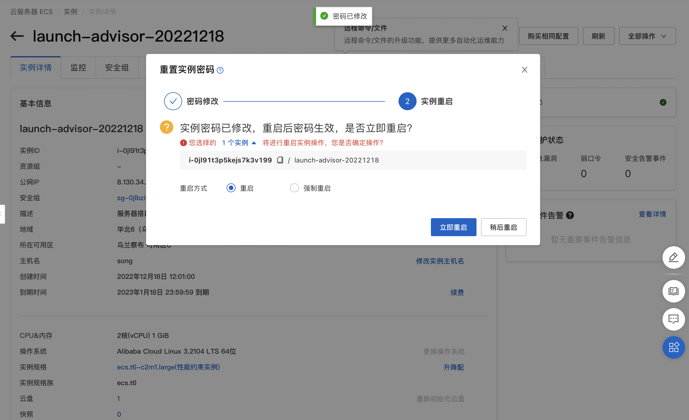
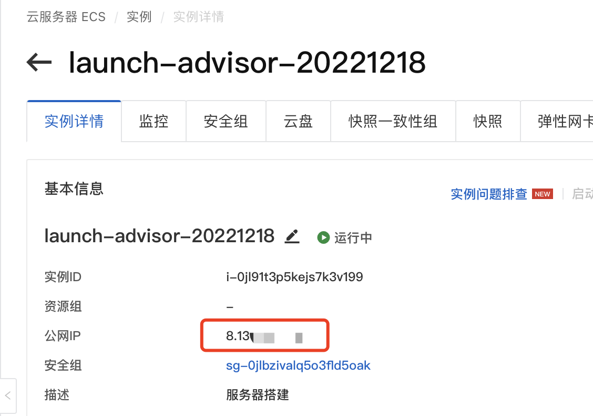
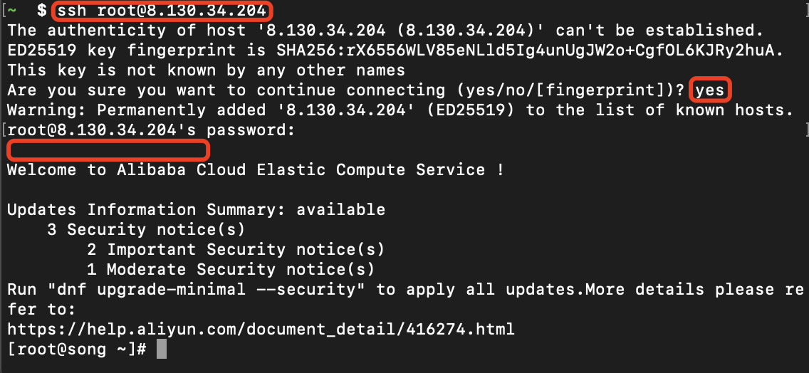

## 前言
本系列文章主要是记录从0开始，一步步搭建个人网址的过程。主要分为3步：
- 购买服务器
- 服务器搭建
- 项目实战

---

下面是第一步（购买服务器）的讲解。
## 一、服务器购买
如果已经有服务器的可跳过。

进入阿里云服务器官网，点击“产品-云服务器ECS”，选择要购买的配置、时长等，支付即可。
以下配置仅供参考：

- 基础配置

  选择自定义配置，选择最低配一个月（主要是便宜）。

  
- 网络和安全组配置

  带宽计费模式选用按流量付费（主要是便宜），其他配置不用修改

- 确认界面
确认没问题后下单付款即可

- 省钱小tip
  1. 地域选华北6（乌兰察布）会便宜点
  2. 实例的分类在共享型中选突发性能型，便宜点
  3. 系统盘选高效云盘，20G，便宜点
  4. 网络的带宽计费模式用按使用流量，简单测试流量一般较少，更便宜
  5. 购买时长一周够用点话就选一周，便宜点

以上小tip，不差钱的可忽略

## 二、重置密码
购买成功后，就可以进入到这个界面，这里说的实例，就是我们所说的服务器

第一次远程连接会提示重置服务器密码，这个密码就是后续远程登陆服务器会用到的，记得保存。

重置密码后服务器需要重启，等待服务器重启完毕即可。

## 三、远程连接
打开电脑的命令行界面（系统自带、第三方的都行），后续的操作主要都在命令行上。 

登陆服务器命令如下：

`ssh 用户名@ip`

用户名默认一般都是root，ip可以在网页端的服务器首页查看：

登陆过程如下，红框部分是需要输入的，最后一个空白的红框就是前面重置的密码。

至此连接服务器，就已经完成了。

---
## 小结
本篇主要介绍了如果购买并连接上服务器。但是目前这服务器还没有任何功能，下篇文章将介绍如果部署一个可以访问的项目。

