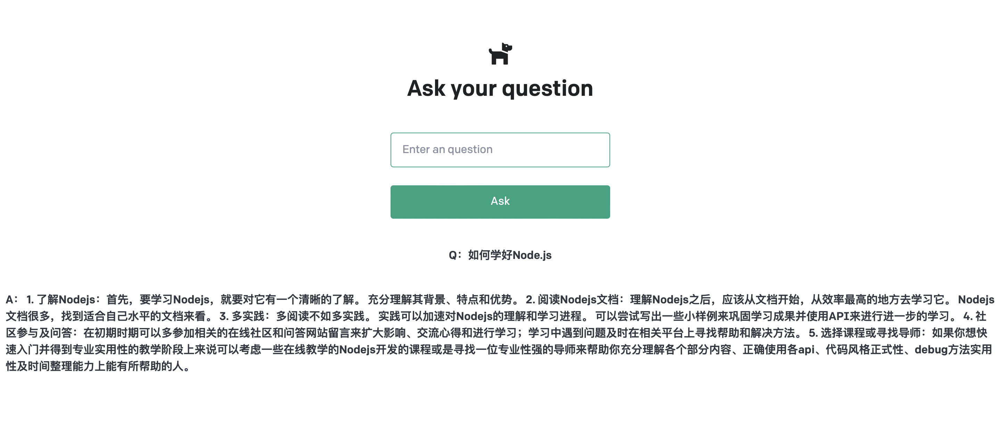
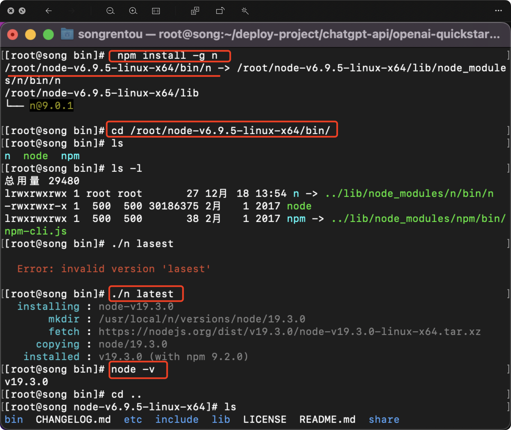

## 前言

本项目运行的最终结果就是在网页端输入问题，通过请求后端的接口，获取对应的回答并展示，如下图：


选ChatGPT当作示例项目是因为刚好在玩这个项目，刚好拿来写这篇文章了，如果有其他项目也行，按照该项目的部署说明操作即可。

## 前提准备
- 一台服务器

  没有服务器的看前两篇文章：
   1. [搭建个人网址(1)——连接服务器](/28862)
   2. [搭建个人网址(2)——服务器环境搭建](/43379)
- ChatGPT的api-key
  
   这个key获取比较麻烦，这里不多介绍，可单独网上搜教程

---

# 1.安装git环境

安装命令

```yum -y install git```

验证是否安装成功

```git --version```

# 2.拉取代码
github项目
[https://github.com/songlj233/openai-quickstart-node.git](https://github.com/songlj233/openai-quickstart-node.git)

gitee项目
[https://gitee.com/songlj233/openai-quickstart-node.git](https://gitee.com/songlj233/openai-quickstart-node.git)

这两个项目是一样的，github网络不大稳定的可以用gitee的。

应该知道怎么下代码吧`git clone xxx`，xxx就是上面的URL。

# 3.升级node版本

部署项目时发现node版本太旧，拉取的项目需要node版本18以上的环境，所以需要先升级node。

安装n命令：

```npm install -g n```

进入n命令所在的文件夹，更新到最新版本：

```./n latest```

检查是否更新成功：

```node -v```

更新node版本的过程截图如下



# 3.编译部署
拉取代码后，参考git项目源码中的README.md操作即可。

根据README.md的操作完，项目就部署成功了，然后打开浏览器访问即可，就可以得到最前面展示的效果图了。

# 4.部署小tip
1. 部署项目的命令是`npm run dev`，运行后会一直存在命令行界面，
用`nohup npm run dev&`命令，则会在后台运行，并把运行的结果输出到当前路径下的"nohup.out"文件中。
2. 上一步的部署命令较长，不容易记，可以新建文本，把部署的命令复制进行，
运行`chmod +x run`增加可执行权限，运行`./run`命令即可部署（其中run就是文件名）。
3. 用了上面的nohup后，运行日志会输出到`nohup.out`文件中，可查看文件进行错误分析
4. 项目重复部署，原3000端口被占用，会用3001端口顺延，浏览器地址记得修改
--- 

## 小结

至此已经搭建完一个简单的ChatGPT的项目，有前端的界面和后端的接口，算是有一个项目的基本样子了。

但是还有个问题，还缺少用来保存数据的数据库服务，那下篇就应用下MySql数据库的使用。
