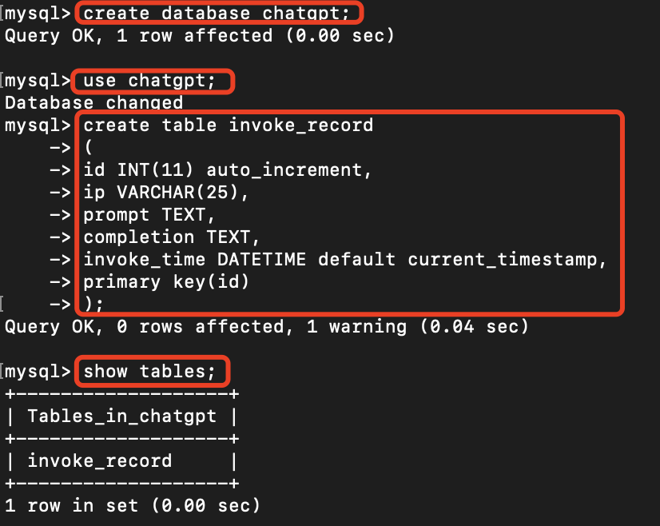
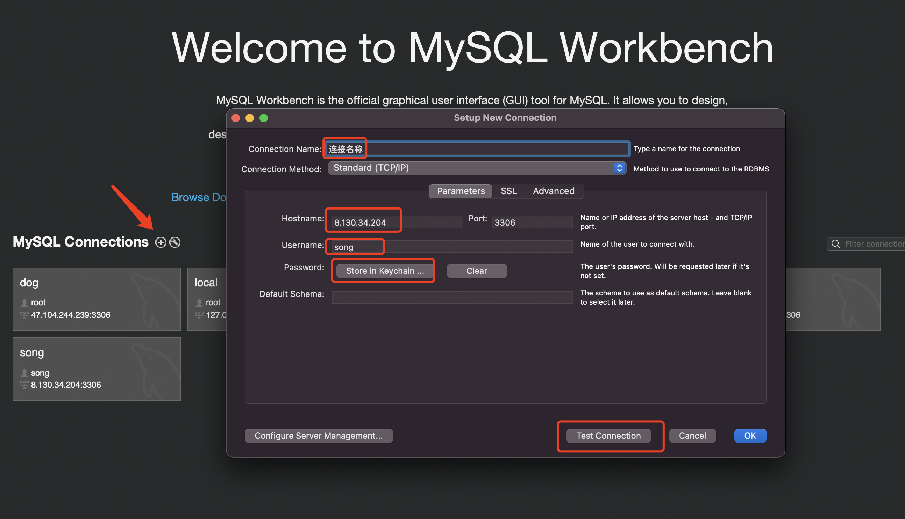
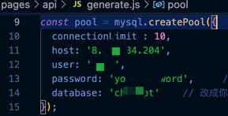

## 前言
本篇文章介绍的是如何在一个项目中，将项目的数据存储到服务器中。

## 前提准备
- 一台服务器，且能正常部署项目

## 安装MySql
1. 下载MySQL的安装包
```
wget http://repo.mysql.com/mysql57-community-release-el7-10.noarch.rpm
```

2. 安装MySQL源
```
rpm -Uvh mysql57-community-release-el7-10.noarch.rpm
```

3. 安装MySQL服务端，需要等待一些时间
```
yum install -y mysql-community-server
```
```
注：如果提示仓库 "MySQL 5.7 Community Server" 的 GPG 公钥已安装，但是不适用于此软件包，
则执行`rpm --import https://repo.mysql.com/RPM-GPG-KEY-mysql-2022` ，然后重新安装
```

4. 启动MySQL
```
systemctl start mysqld.service
```

5. 检查是否启动成功
```
systemctl status mysqld.service
```

## 创建数据库
先进入mysql命令行界面
```
默认情况下，用`mysql`命令即可

如果报错：ERROR 1045 (28000): Access denied for user 'root'@'localhost'，
则修改 /etc/my.cnf文件，在最后加入skip-grant-tables

然后重启数据库：systemctl restart mysqld
```

然后是创建数据库
```
create database chatgpt;
```

指定刚创建的数据库（因为本地可以创建多个数据库，所以必须先指定当前用的是哪个数据库）
```
use chatgpt;
```

创建表
```
create table invoke_record
(
id INT(11) auto_increment,
ip VARCHAR(25),
prompt TEXT,
completion TEXT,
invoke_time DATETIME default current_timestamp,
primary key(id)
);
```
运行效果如下图



用`exit`退出mysql命令行。

注：命令后面要加`;`符号才开始执行。

补充些常用命令
```
插入数据
    INSERT INTO invoke_record(ip, prompt, completion) VALUES("ip1","prompt2","completion3");
查询数据
    select * from invoke_record;
```

## 远程访问数据库
### MySql可视化软件
在个人电脑上安装MySql可视化软件，Window可使用Navicat，Mac上使用MySQLWorkBench。
以MySQLWorkBench为例：

新建连接，填写连接的参数，包括连接名、IP、端口（默认3306）、用户名、密码。
填完后点击下面的测试连接是否成功。

如果测试失败，原因可能是默认账号不支持远程登陆，所以往下看，创建新的数据库用户。

### 创建数据库用户
创建新用户，用于远程登陆，命令如下。
```
CREATE USER 'song'@'localhost' IDENTIFIED BY 'pwd123';
GRANT ALL PRIVILEGES ON *.* TO 'song'@'localhost' WITH GRANT OPTION;
CREATE USER 'song'@'%' IDENTIFIED BY 'pwd123';
GRANT ALL PRIVILEGES ON *.* TO 'song'@'%' WITH GRANT OPTION;
```
上面命令中的song是用户名，pwd123是密码，替换成自己的即可。

新增账号密码后，在命令行中进入数据库界面的命令就可以用这个
```
mysql -u song -p
```
按回车后根据提示，输入密码`pwd123`

能成功进入mysql命令行，说明新用户创建成功，回到前面的可视化软件，再次尝试应该就可以了。

```
如果数据库保存中文失败，
则修改 /etc/my.cnf文件，在最后加入

[client]
default-character-set = utf8mb4

[mysql]
default-character-set = utf8mb4

[mysqld]
character-set-client-handshake = FALSE
character-set-server = utf8mb4
collation-server = utf8mb4_bin  #utf8mb4_unicode_ci 会导致部分字符查询出错

然后重启数据库：systemctl restart mysqld
```

## 项目实践
1. 更新上篇文章的ChatGpt项目的代码，具体做法：进入项目所在的目录，运行`git pull`命令。

2. 修改代码中generate.js文件中的数据库参数，如下图：



3. 重新部署程序，当每次请求时，不出意外的话，请求的信息就会保存到数据库中。

4. 查看数据库的内容，用命令行和用可视化软件都可以，查询语句为`select * from invoke_record`。

至此已经可以在项目进行数据库的操作了。

## 小结
自此，对MySql的基本使用已经介绍完成了。现在已经有个项目的基本样子了，后续的工作主要就是修改代码了，如修改网页界面，增加功能等。
